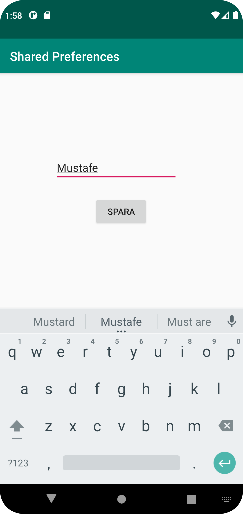

# Rapport

**

Shared Preferences is the way in which one can store and retrieve small amounts of primitive data as key/value pairs to a file on the device storage such as String, int, float, Boolean that make up your preferences in an XML file inside the app on the device storage.
```
          final EditText editText = findViewById(R.id.edit_text);
        Button button = findViewById(R.id.edit_button);
        button.setOnClickListener(new View.OnClickListener() {
            @Override
            public void onClick(View v) {
                String value = editText.getText().toString().trim();
                SharedPreferences sharedPref = getSharedPreferences("myKey", MODE_PRIVATE);
                SharedPreferences.Editor editor = sharedPref.edit();
                editor.putString("value", value);
                editor.apply();
                Intent intent = new Intent(SegondActivity.this, MainActivity.class);
                startActivity(intent);
            }
        });
```
This is How i use the text edit and saved store in diferent activiti within app.

```
        Button button = findViewById(R.id.edit_button2);
        button.setOnClickListener(new View.OnClickListener() {
            @Override
            public void onClick(View v) {

                Intent intent = new Intent(MainActivity.this, SegondActivity.class);
                startActivity(intent);
            }
        });
```
This code is how i go back in edit text with the help of this button.

```
        TextView textView = findViewById(R.id.name);
        SharedPreferences sharedPreferences = getSharedPreferences("myKey", MODE_PRIVATE);
        String value = sharedPreferences.getString("value", "");
        textView.setText(value);
```
And this code is how the store is saved in MainActivity.


**

_Du kan ta bort all text som finns sedan tidigare_.

## Följande grundsyn gäller dugga-svar:

- Ett kortfattat svar är att föredra. Svar som är längre än en sida text (skärmdumpar och programkod exkluderat) är onödigt långt.
- Svaret skall ha minst en snutt programkod.
- Svaret skall inkludera en kort övergripande förklarande text som redogör för vad respektive snutt programkod gör eller som svarar på annan teorifråga.
- Svaret skall ha minst en skärmdump. Skärmdumpar skall illustrera exekvering av relevant programkod. Eventuell text i skärmdumpar måste vara läsbar.
- I de fall detta efterfrågas, dela upp delar av ditt svar i för- och nackdelar. Dina för- respektive nackdelar skall vara i form av punktlistor med kortare stycken (3-4 meningar).

Programkod ska se ut som exemplet nedan. Koden måste vara korrekt indenterad då den blir lättare att läsa vilket gör det lättare att hitta syntaktiska fel.

```
```
        TextView textView = findViewById(R.id.name);
        SharedPreferences sharedPreferences = getSharedPreferences("myKey", MODE_PRIVATE);
        String value = sharedPreferences.getString("value", "");
        textView.setText(value);
```

```
        Button button = findViewById(R.id.edit_button2);
        button.setOnClickListener(new View.OnClickListener() {
            @Override
            public void onClick(View v) {

                Intent intent = new Intent(MainActivity.this, SegondActivity.class);
                startActivity(intent);
            }
        });
```

```
        TextView textView = findViewById(R.id.name);
        SharedPreferences sharedPreferences = getSharedPreferences("myKey", MODE_PRIVATE);
        String value = sharedPreferences.getString("value", "");
        textView.setText(value);
```
```

Bilder läggs i samma mapp som markdown-filen.




Läs gärna:

- Boulos, M.N.K., Warren, J., Gong, J. & Yue, P. (2010) Web GIS in practice VIII: HTML5 and the canvas element for interactive online mapping. International journal of health geographics 9, 14. Shin, Y. &
- Wunsche, B.C. (2013) A smartphone-based golf simulation exercise game for supporting arthritis patients. 2013 28th International Conference of Image and Vision Computing New Zealand (IVCNZ), IEEE, pp. 459–464.
- Wohlin, C., Runeson, P., Höst, M., Ohlsson, M.C., Regnell, B., Wesslén, A. (2012) Experimentation in Software Engineering, Berlin, Heidelberg: Springer Berlin Heidelberg.
